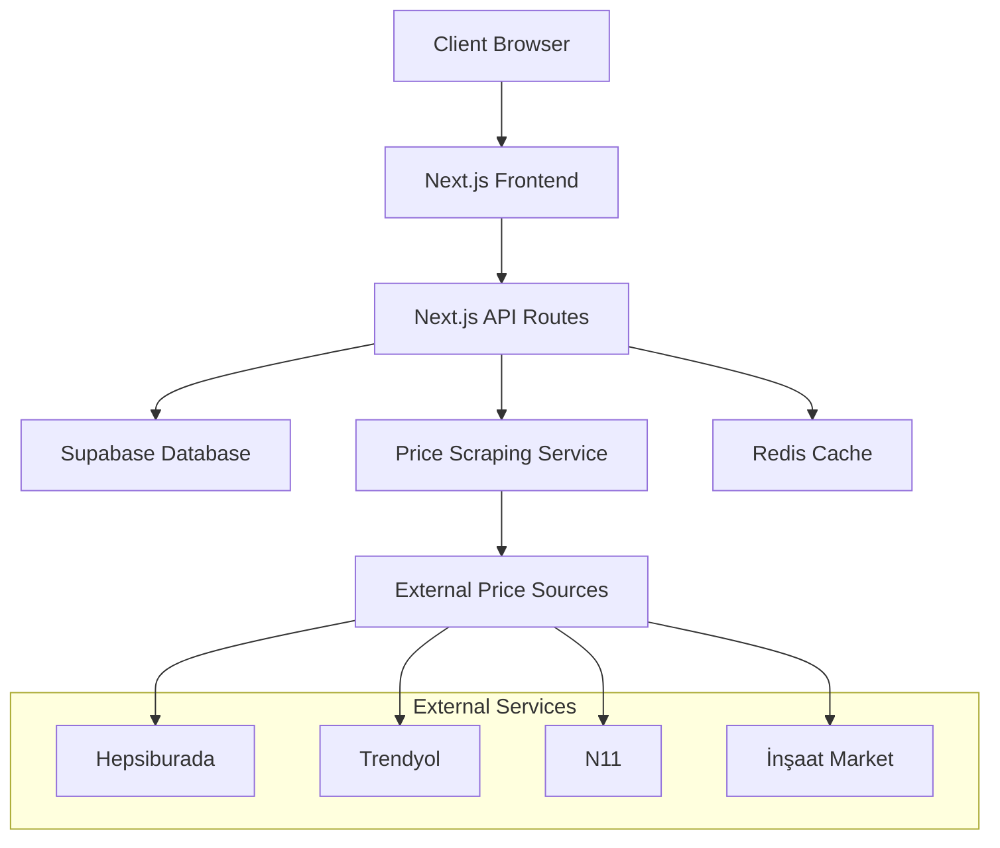

# İnşaat Malzeme Hesap Makinesi

## Tavan ve Duvar İşleri İçin Malzeme Hesaplama ve Fiyat Takip Sistemi

---

## 📋 İçindekiler

1. [Proje Genel Bakış](#proje-genel-bakış)
2. [Teknik Özellikler](#teknik-özellikler)
3. [Sistem Mimarisi](#sistem-mimarisi)
4. [Hesaplama Modülleri](#hesaplama-modülleri)
5. [Kullanıcı Arayüzü Tasarımı](#kullanıcı-arayüzü-tasarımı)
6. [Backend API Yapısı](#backend-api-yapısı)
7. [Veritabanı Şeması](#veritabanı-şeması)
8. [Fiyat Çekme Sistemi](#fiyat-çekme-sistemi)
9. [Geliştirme Süreci](#geliştirme-süreci)
10. [Deployment ve DevOps](#deployment-ve-devops)

---

## 🎯 Proje Genel Bakış

### Amaç

İnşaat sektöründe çalışan profesyoneller için tavan ve duvar işlerinde kullanılacak malzemelerin miktarını hesaplayan ve güncel fiyat bilgilerini takip eden web tabanlı bir uygulama geliştirmek.

### Hedef Kullanıcılar

- İnşaat müteahhitleri
- Alçıpan ustaları
- İnşaat malzemesi satıcıları
- Proje yöneticileri
- Bireysel kullanıcılar

### Ana Özellikler

- **Otomatik Hesaplama**: m² değeri ile malzeme miktarlarının otomatik hesaplanması
- **Gerçek Zamanlı Fiyatlandırma**: Online kaynaklardan güncel fiyat çekme
- **Çoklu Hesap Tipi**: Farklı tavan ve duvar türleri için özelleştirilmiş hesaplamalar
- **Maliyet Analizi**: Detaylı maliyet raporlaması ve karşılaştırma
- **Responsive Tasarım**: Mobil ve masaüstü uyumlu arayüz

---

## 🛠 Teknik Özellikler

### Frontend Teknolojileri

```
- Framework: Next.js 15 (App Router)
- Styling: Tailwind CSS
- İkonlar: Heroicons/Lucide Icons
- State Management: Zustand/Context API
- Form Validation: React Hook Form + Zod
- Animasyonlar: Framer Motion
- Charts: Recharts
```

### Backend Teknolojileri

```
- Runtime: Node.js
- Framework: Next.js API Routes
- Validation: Zod
- Web Scraping: Puppeteer/Cheerio
- Caching: Redis/Upstash
- Rate Limiting: @upstash/ratelimit
```

### Veritabanı ve Hosting

```
- Veritabanı: Supabase (PostgreSQL)
- Authentication: Supabase Auth
- Storage: Supabase Storage
- Hosting: Vercel
- CDN: Vercel Edge Network
```

---

## 🏗 Sistem Mimarisi



### Katmanlı Mimari Yaklaşımı

#### 1. Presentation Layer (Sunum Katmanı)

- **Bileşenler**: React bileşenleri
- **Sayfalar**: Next.js sayfa yapıları
- **Stil**: Tailwind CSS utility sınıfları

#### 2. Business Logic Layer (İş Mantığı Katmanı)

- **Hesaplama Servisleri**: Malzeme miktarı hesaplamaları
- **Validasyon**: Giriş verilerinin doğrulanması
- **Fiyat Hesaplama**: Toplam maliyet hesaplamaları

#### 3. Data Access Layer (Veri Erişim Katmanı)

- **Supabase Client**: Veritabanı operasyonları
- **Caching Service**: Redis ile önbellekleme
- **External APIs**: Fiyat çekme servisleri

---

## 📊 Hesaplama Modülleri

### 1. Tavan Hesaplama Modülü

#### Düz Tavan Hesaplaması

```typescript
interface DuzTavanMalzemeler {
  beyazAlcipan: number; // 0.33 × m²
  cAdedi: number; // 0.853 × m²
  uAdedi: number; // 0.3 × m²
  askiTeli: number; // 0.73 × m²
  askiMasasi: number; // 0.73 × m²
  klips: number; // 2.915 × m²
  vida: number; // 16 × m²
}
```

#### Karopan Tavan Hesaplaması

```typescript
interface KaropanTavanMalzemeler {
  tAnaTasiyici: number; // 0.231 × m²
  tali120Tasiyici: number; // 1.43 × m²
  tali60Tasiyici: number; // 1.47 × m²
  plakaAdedi: number; // 3 × m²
  uAdedi: number; // 0.3 × m²
  vidaAdedi: number; // 16 × m²
}
```

#### Klipin Tavan Hesaplaması

```typescript
interface KlipinTavanMalzemeler {
  omega: number; // 0.853 × m²
  plaka: number; // 3 × m²
  uAdedi: number; // 0.3 × m²
  vidaAdedi: number; // 16 × m²
}
```

### 2. Duvar Hesaplama Modülü

#### Giydirme Duvar

```typescript
interface GiydirmeMalzemeler {
  uAdedi: number; // 0.29 × m²
  cAdedi: number; // 0.58 × m²
  vida: number; // 22 × m²
  alcipan: number; // 0.36 × m²
  agraf: number; // 3.5 × m²
  dubelCivi: number; // 1.74 × m²
}
```

#### Tek Kat Tek İskelet

```typescript
interface TekKatMalzemeler {
  uAdedi: number; // 0.29 × m²
  cAdedi: number; // 0.58 × m²
  vida: number; // 44 × m²
  alcipan: number; // 0.73 × m²
  dubelCivi: number; // 1.74 × m²
}
```

#### Çift Kat Çift İskelet

```typescript
interface CiftKatMalzemeler {
  uAdedi: number; // 0.58 × m²
  cAdedi: number; // 1.16 × m²
  vida25: number; // 22 × m²
  vida35: number; // 44 × m²
  alcipan: number; // 1.47 × m²
  dubelCivi: number; // 3.48 × m²
}
```

---

## 🎨 Kullanıcı Arayüzü Tasarımı

### Sayfa Yapısı

#### 1. Ana Sayfa (/)

```
├── Header (Logo, Navigation, User Menu)
├── Hero Section (Hesap Makinesi Girişi)
│   ├── M² Input Field
│   ├── İş Tipi Seçimi (Tavan/Duvar)
│   └── Alt Tip Seçimi
├── Hesaplama Sonuçları
│   ├── Malzeme Listesi
│   ├── Fiyat Bilgileri
│   └── Toplam Maliyet
└── Footer
```

#### 2. Hesaplama Detayı (/calculation/[id])

```
├── Breadcrumb Navigation
├── Hesaplama Özeti
├── Detaylı Malzeme Tablosu
├── Fiyat Karşılaştırması
├── PDF Export Butonu
└── Paylaşım Seçenekleri
```

#### 4. URL Yönetimi Sayfası (/admin/scraping-urls)

```
├── Breadcrumb Navigation
├── URL Yönetim Paneli
│   ├── Kaynak Siteler Yönetimi
│   │   ├── Aktif Kaynaklar Listesi
│   │   ├── Yeni Kaynak Ekleme Formu
│   │   └── Kaynak Konfigürasyon Paneli
│   ├── Özel URL'ler
│   │   ├── Malzeme Bazlı URL Listesi
│   │   ├── URL Test Aracı
│   │   └── Toplu URL İmport Aracı
│   └── Scraping Logları
│       ├── Başarılı/Başarısız İşlemler
│       ├── Performans Metrikleri
│       └── Hata Raporları
└── Live Preview Paneli
```

#### 5. URL Test ve Önizleme (/admin/url-tester)

```
├── URL Test Formu
│   ├── Hedef URL Input
│   ├── CSS Selector Ayarları
│   ├── Test Butonu
│   └── Gerçek Zamanlı Önizleme
├── Scraping Sonuç Paneli
│   ├── Çekilen Veri Gösterimi
│   ├── Hata Mesajları
│   └── Performance Metrikleri
└── Kaydetme ve Aktivasyon
```

### Component Hierarşisi

```
App
├── Layout
│   ├── Header
│   │   ├── Logo
│   │   ├── Navigation
│   │   └── UserMenu
│   ├── Main
│   │   ├── CalculationForm
│   │   │   ├── AreaInput
│   │   │   ├── JobTypeSelector
│   │   │   └── SubTypeSelector
│   │   ├── ResultsPanel
│   │   │   ├── MaterialList
│   │   │   ├── PriceInfo
│   │   │   └── TotalCost
│   │   ├── ComparisonChart
│   │   └── AdminPanel (Admin Only)
│   │       ├── ScrapingSourceManager
│   │       │   ├── SourceList
│   │       │   ├── AddSourceForm
│   │       │   └── SourceConfigEditor
│   │       ├── CustomUrlManager
│   │       │   ├── MaterialUrlsList
│   │       │   ├── UrlTestTool
│   │       │   └── BulkImportTool
│   │       └── ScrapingLogs
│   └── Footer
└── GlobalModals
    ├── AuthModal
    ├── ShareModal
    ├── ExportModal
    └── UrlConfigModal
        ├── UrlInputForm
        ├── SelectorConfigForm
        └── LivePreview
```

---

## 🔌 Backend API Yapısı

### API Endpoints

#### Hesaplama Endpointleri

```typescript
// POST /api/calculate
interface CalculationRequest {
  area: number;
  jobType: 'ceiling' | 'wall';
  subType: string;
  userId?: string;
}

interface CalculationResponse {
  id: string;
  materials: Material[];
  totalQuantity: number;
  estimatedCost: number;
  priceLastUpdated: Date;
}
```

#### Scraping Sources API'leri

```typescript
// POST /api/admin/scraping-sources
interface CreateSourceRequest {
  name: string;
  baseUrl: string;
  scrapingConfig: {
    priceSelector: string;
    titleSelector?: string;
    searchUrlPattern?: string;
    userAgent?: string;
    waitForSelector?: string;
    dynamicContent?: boolean;
  };
}

interface CreateSourceResponse {
  id: string;
  name: string;
  baseUrl: string;
  isActive: boolean;
}

// GET /api/admin/scraping-sources
interface SourcesListResponse {
  sources: ScrapingSource[];
  pagination: PaginationInfo;
}

// PUT /api/admin/scraping-sources/[id]/toggle
interface ToggleSourceRequest {
  isActive: boolean;
}
```

#### Custom URLs API'leri

```typescript
// POST /api/custom-urls
interface CreateCustomUrlRequest {
  materialId: string;
  sourceId: string;
  customUrl: string;
  cssSelectors?: {
    price: string;
    title?: string;
    availability?: string;
  };
  notes?: string;
}

interface CreateCustomUrlResponse {
  id: string;
  materialId: string;
  sourceId: string;
  customUrl: string;
  isActive: boolean;
}

// GET /api/custom-urls/material/[materialId]
interface MaterialCustomUrlsResponse {
  customUrls: CustomUrl[];
  availableSources: ScrapingSource[];
}

// POST /api/custom-urls/[id]/test
interface TestUrlRequest {
  customUrl?: string;
  cssSelectors?: Record<string, string>;
}

interface TestUrlResponse {
  success: boolean;
  price?: number;
  title?: string;
  error?: string;
  previewData?: {
    price: number;
    title: string;
    availability: string;
    scrapedAt: Date;
  };
}

// DELETE /api/custom-urls/[id]
interface DeleteCustomUrlResponse {
  success: boolean;
  message: string;
}
```

#### Kullanıcı Endpointleri

```typescript
// GET /api/user/calculations
interface UserCalculationsResponse {
  calculations: Calculation[];
  pagination: {
    page: number;
    limit: number;
    total: number;
  };
}

// POST /api/user/calculations/[id]/save
interface SaveCalculationRequest {
  name?: string;
  notes?: string;
}
```

### Middleware Yapısı

```typescript
// middleware/auth.ts
export function authMiddleware(req: Request) {
  // JWT token validation
  // User session management
}

// middleware/rateLimit.ts
export function rateLimitMiddleware() {
  // API rate limiting
  // Abuse prevention
}

// middleware/cors.ts
export function corsMiddleware() {
  // Cross-origin resource sharing
}
```

---

## 🗄 Veritabanı Şeması

### Tablo Yapıları

#### Scraping Sources Tablosu

```sql
CREATE TABLE scraping_sources (
  id UUID PRIMARY KEY DEFAULT gen_random_uuid(),
  name VARCHAR(255) NOT NULL,
  base_url VARCHAR(500) NOT NULL,
  is_active BOOLEAN DEFAULT true,
  scraping_config JSONB,
  created_at TIMESTAMP DEFAULT NOW(),
  updated_at TIMESTAMP DEFAULT NOW()
);
```

#### Custom URLs Tablosu

```sql
CREATE TABLE custom_scraping_urls (
  id UUID PRIMARY KEY DEFAULT gen_random_uuid(),
  material_id UUID REFERENCES materials(id),
  source_id UUID REFERENCES scraping_sources(id),
  custom_url TEXT NOT NULL,
  css_selectors JSONB,
  is_active BOOLEAN DEFAULT true,
  notes TEXT,
  created_by UUID REFERENCES auth.users(id),
  created_at TIMESTAMP DEFAULT NOW(),
  updated_at TIMESTAMP DEFAULT NOW()
);
```

#### Material_Prices Tablosu (Güncelleme)

```sql
CREATE TABLE material_prices (
  id UUID PRIMARY KEY DEFAULT gen_random_uuid(),
  material_id UUID REFERENCES materials(id),
  source_id UUID REFERENCES scraping_sources(id),
  custom_url_id UUID REFERENCES custom_scraping_urls(id), -- Yeni alan
  price DECIMAL(10,2) NOT NULL,
  currency VARCHAR(3) DEFAULT 'TRY',
  scraped_url TEXT,
  scraped_at TIMESTAMP DEFAULT NOW(),
  is_active BOOLEAN DEFAULT true
);
```

#### Calculation_Materials Tablosu

```sql
CREATE TABLE calculation_materials (
  id UUID PRIMARY KEY DEFAULT gen_random_uuid(),
  calculation_id UUID REFERENCES calculations(id),
  material_id UUID REFERENCES materials(id),
  quantity DECIMAL(10,3) NOT NULL,
  unit_price DECIMAL(10,2),
  total_price DECIMAL(12,2),
  coefficient DECIMAL(6,3) NOT NULL
);
```

### İndeksler ve Optimizasyonlar

```sql
-- Performance indexes
CREATE INDEX idx_calculations_user_id ON calculations(user_id);
CREATE INDEX idx_calculations_created_at ON calculations(created_at DESC);
CREATE INDEX idx_material_prices_material_id ON material_prices(material_id);
CREATE INDEX idx_material_prices_scraped_at ON material_prices(scraped_at DESC);

-- Compound indexes
CREATE INDEX idx_material_prices_active_recent
ON material_prices(material_id, is_active, scraped_at DESC);
```

---

## 💰 Fiyat Çekme Sistemi

### Web Scraping Architecture

```typescript
// services/scraping/baseScraper.ts
abstract class BaseScraper {
  abstract source: string;
  abstract baseUrl: string;

  abstract scrapePrice(
    materialName: string,
    customUrl?: string
  ): Promise<PriceData>;

  protected async fetchPage(url: string): Promise<string> {
    // Puppeteer implementation
  }

  protected parsePrice(priceText: string): number {
    // Price parsing logic
  }
}

// services/scraping/configurableScraper.ts
class ConfigurableScraper extends BaseScraper {
  source: string;
  baseUrl: string;

  constructor(config: ScrapingConfig) {
    super();
    this.source = config.sourceName;
    this.baseUrl = config.baseUrl;
  }

  async scrapePrice(
    materialName: string,
    customUrl?: string
  ): Promise<PriceData> {
    const url = customUrl || this.buildSearchUrl(materialName);
    // Configurable scraping logic based on CSS selectors
  }
}

// services/scraping/hepsiburadaScraper.ts
class HepsiburadaScraper extends BaseScraper {
  source = 'Hepsiburada';
  baseUrl = 'https://www.hepsiburada.com';

  async scrapePrice(
    materialName: string,
    customUrl?: string
  ): Promise<PriceData> {
    // Hepsiburada-specific scraping logic with custom URL support
  }
}
```

### Fiyat Güncelleme Stratejisi

#### 1. Zamanlanmış Güncellemeler

```typescript
// jobs/priceUpdateJob.ts
export async function scheduledPriceUpdate() {
  const materials = await getMaterialsForUpdate();

  for (const material of materials) {
    await updateMaterialPrices(material.id);
    await delay(1000); // Rate limiting
  }
}
```

#### 2. Gelişmiş Scraping Servisi

```typescript
// services/scraping/advancedScraper.ts
export class AdvancedScrapingService {
  private scrapers: Map<string, BaseScraper> = new Map();
  private customUrls: Map<string, CustomUrlConfig> = new Map();

  async addCustomSource(config: ScrapingSourceConfig) {
    const scraper = new ConfigurableScraper(config);
    this.scrapers.set(config.id, scraper);
  }

  async addCustomUrl(materialId: string, urlConfig: CustomUrlConfig) {
    const key = `${materialId}-${urlConfig.sourceId}`;
    this.customUrls.set(key, urlConfig);
  }

  async scrapeWithCustomUrl(
    materialId: string,
    sourceId: string
  ): Promise<PriceData> {
    const key = `${materialId}-${sourceId}`;
    const customConfig = this.customUrls.get(key);

    if (customConfig) {
      return this.scrapeCustomUrl(customConfig);
    }

    // Fallback to default scraping
    const scraper = this.scrapers.get(sourceId);
    return scraper?.scrapePrice(materialId);
  }

  private async scrapeCustomUrl(config: CustomUrlConfig): Promise<PriceData> {
    const page = await this.browser.newPage();

    try {
      await page.goto(config.url, { waitUntil: 'networkidle2' });

      // Wait for custom selector if specified
      if (config.cssSelectors.waitFor) {
        await page.waitForSelector(config.cssSelectors.waitFor, {
          timeout: 10000,
        });
      }

      // Extract price using custom selector
      const priceElement = await page.$(config.cssSelectors.price);
      const priceText = await priceElement?.evaluate(el => el.textContent);

      // Extract title if selector provided
      let title = '';
      if (config.cssSelectors.title) {
        const titleElement = await page.$(config.cssSelectors.title);
        title = (await titleElement?.evaluate(el => el.textContent)) || '';
      }

      const price = this.parsePrice(priceText || '0');

      return {
        materialId: config.materialId,
        source: config.sourceName,
        price,
        title: title.trim(),
        url: config.url,
        scrapedAt: new Date(),
      };
    } catch (error) {
      throw new Error(`Scraping failed for ${config.url}: ${error.message}`);
    } finally {
      await page.close();
    }
  }

  async testCustomUrl(urlConfig: TestUrlConfig): Promise<TestResult> {
    try {
      const result = await this.scrapeCustomUrl({
        ...urlConfig,
        materialId: 'test',
        sourceId: 'test',
        sourceName: 'Test',
      });

      return {
        success: true,
        data: result,
        message: 'URL test başarılı',
      };
    } catch (error) {
      return {
        success: false,
        error: error.message,
        message: 'URL test başarısız',
      };
    }
  }
}

// Types for custom URL configuration
interface CustomUrlConfig {
  materialId: string;
  sourceId: string;
  sourceName: string;
  url: string;
  cssSelectors: {
    price: string;
    title?: string;
    availability?: string;
    waitFor?: string;
  };
  notes?: string;
}

interface ScrapingSourceConfig {
  id: string;
  name: string;
  baseUrl: string;
  defaultSelectors: {
    price: string;
    title?: string;
    searchUrlPattern?: string;
  };
  options: {
    userAgent?: string;
    timeout?: number;
    waitForSelector?: string;
    dynamicContent?: boolean;
  };
}

interface TestResult {
  success: boolean;
  data?: PriceData;
  error?: string;
  message: string;
}
```

#### 3. Önbellekleme Stratejisi

```typescript
// Cache configuration
const cacheConfig = {
  priceCache: {
    ttl: 3600, // 1 hour
    staleWhileRevalidate: 7200, // 2 hours
  },
  materialListCache: {
    ttl: 86400, // 24 hours
  },
};
```

---

## 🚀 Geliştirme Süreci

### Proje Yapısı

```
project-root/
├── src/
│   ├── app/                 # Next.js App Router
│   │   ├── (auth)/         # Authentication pages
│   │   ├── calculation/    # Calculation pages
│   │   ├── admin/          # Admin panel pages
│   │   │   ├── scraping-sources/  # Source management
│   │   │   ├── custom-urls/       # URL management
│   │   │   └── url-tester/        # URL testing tool
│   │   ├── api/           # API routes
│   │   │   ├── admin/     # Admin API endpoints
│   │   │   │   ├── scraping-sources/
│   │   │   │   └── custom-urls/
│   │   │   ├── scraping/  # Scraping API endpoints
│   │   │   └── prices/    # Price API endpoints
│   │   └── globals.css    # Global styles
│   ├── components/        # React components
│   │   ├── ui/           # Reusable UI components
│   │   ├── forms/        # Form components
│   │   ├── charts/       # Chart components
│   │   └── admin/        # Admin-specific components
│   │       ├── ScrapingSourceManager/
│   │       ├── CustomUrlManager/
│   │       ├── UrlTestTool/
│   │       └── ScrapingLogs/
│   ├── lib/              # Utilities and configurations
│   │   ├── supabase.ts   # Supabase client
│   │   ├── utils.ts      # Helper functions
│   │   └── validations.ts # Zod schemas
│   ├── services/         # Business logic services
│   │   ├── calculations/ # Calculation services
│   │   ├── pricing/      # Price services
│   │   └── scraping/     # Web scraping services
│   │       ├── baseScraper.ts
│   │       ├── configurableScraper.ts
│   │       ├── advancedScrapingService.ts
│   │       └── scrapers/  # Individual scrapers
│   └── types/            # TypeScript type definitions
│       ├── scraping.ts   # Scraping-related types
│       └── admin.ts      # Admin-related types
├── public/               # Static assets
├── docs/                 # Documentation
├── tests/                # Test files
│   └── scraping/        # Scraping-specific tests
└── config files         # Configuration files
```

### Geliştirme Aşamaları

#### Phase 1: Temel Altyapı (2 hafta)

- [ ] Next.js projesinin kurulumu
- [ ] Supabase entegrasyonu
- [ ] Temel component library
- [ ] Authentication sistemi
- [ ] Responsive layout

#### Phase 2: Hesaplama Motoru (2 hafta)

- [ ] Malzeme katsayıları sisteminin geliştirilmesi
- [ ] Hesaplama algoritmalarının implementasyonu
- [ ] Form validasyonları
- [ ] Sonuç görüntüleme arayüzü
- [ ] Unit testlerin yazılması

#### Phase 3: Fiyat Sistemi (3 hafta)

- [ ] Web scraping altyapısının kurulması
- [ ] **Scraping kaynakları yönetim sistemi**
- [ ] **Özel URL ekleme ve test arayüzü**
- [ ] **CSS selector konfigürasyon paneli**
- [ ] Fiyat çekme servislerinin geliştirilmesi
- [ ] Cache sistemi implementasyonu
- [ ] Rate limiting ve error handling
- [ ] **Admin paneli ile URL yönetimi**
- [ ] **Scraping performans monitörü**
- [ ] Fiyat güncelleme job'larının kurulması

#### Phase 4: Kullanıcı Deneyimi (2 hafta)

- [ ] Geçmiş hesaplamalar sayfası
- [ ] PDF export özelliği
- [ ] Paylaşım özelliği
- [ ] Karşılaştırma aracı
- [ ] **URL test ve önizleme aracı**
- [ ] **Toplu URL import özelliği**
- [ ] Mobil optimizasyon

#### Phase 5: Test ve Deploy (1 hafta)

- [ ] End-to-end testler
- [ ] Performance optimizasyonu
- [ ] SEO optimizasyonu
- [ ] Production deployment
- [ ] Monitoring kurulumu

### Kod Kalitesi ve Standartlar

#### ESLint Konfigürasyonu

```json
{
  "extends": [
    "next/core-web-vitals",
    "@typescript-eslint/recommended",
    "prettier"
  ],
  "rules": {
    "prefer-const": "error",
    "no-unused-vars": "error",
    "@typescript-eslint/no-explicit-any": "warn"
  }
}
```

#### Prettier Konfigürasyonu

```json
{
  "semi": true,
  "trailingComma": "es5",
  "singleQuote": true,
  "printWidth": 80,
  "tabWidth": 2
}
```

---

## 🌐 Deployment ve DevOps

### Hosting Stratejisi

#### Vercel Deployment

```yaml
# vercel.json
{
  'builds': [{ 'src': 'next.config.js', 'use': '@vercel/next' }],
  'env':
    {
      'NEXT_PUBLIC_SUPABASE_URL': '@supabase_url',
      'NEXT_PUBLIC_SUPABASE_ANON_KEY': '@supabase_anon_key',
      'SUPABASE_SERVICE_ROLE_KEY': '@supabase_service_key',
    },
  'crons': [{ 'path': '/api/cron/update-prices', 'schedule': '0 6 * * *' }],
}
```

#### Environment Variables

```env
# .env.local
NEXT_PUBLIC_SUPABASE_URL=your_supabase_url
NEXT_PUBLIC_SUPABASE_ANON_KEY=your_supabase_anon_key
SUPABASE_SERVICE_ROLE_KEY=your_service_role_key
UPSTASH_REDIS_REST_URL=your_redis_url
UPSTASH_REDIS_REST_TOKEN=your_redis_token
NEXTAUTH_SECRET=your_nextauth_secret
NEXTAUTH_URL=https://your-domain.com
```

### CI/CD Pipeline

```yaml
# .github/workflows/deploy.yml
name: Deploy to Vercel

on:
  push:
    branches: [main, develop]
  pull_request:
    branches: [main]

jobs:
  test:
    runs-on: ubuntu-latest
    steps:
      - uses: actions/checkout@v3
      - uses: actions/setup-node@v3
        with:
          node-version: '18'
          cache: 'npm'

      - run: npm ci
      - run: npm run lint
      - run: npm run type-check
      - run: npm run test
      - run: npm run build

  deploy:
    needs: test
    runs-on: ubuntu-latest
    if: github.ref == 'refs/heads/main'
    steps:
      - uses: actions/checkout@v3
      - uses: amondnet/vercel-action@v25
        with:
          vercel-token: ${{ secrets.VERCEL_TOKEN }}
          vercel-org-id: ${{ secrets.ORG_ID }}
          vercel-project-id: ${{ secrets.PROJECT_ID }}
          vercel-args: '--prod'
```

### Monitoring ve Analytics

#### Error Tracking

```typescript
// lib/sentry.ts
import * as Sentry from '@sentry/nextjs';

Sentry.init({
  dsn: process.env.NEXT_PUBLIC_SENTRY_DSN,
  environment: process.env.NODE_ENV,
  tracesSampleRate: 0.1,
});
```

#### Performance Monitoring

```typescript
// lib/analytics.ts
import { Analytics } from '@vercel/analytics/react';

export function AnalyticsWrapper({ children }: { children: React.ReactNode }) {
  return (
    <>
      {children}
      <Analytics />
    </>
  );
}
```

---

## 📈 Performans Optimizasyonları

### Frontend Optimizasyonları

#### 1. Code Splitting

```typescript
// Dynamic imports for heavy components
const HeavyCalculationComponent = dynamic(
  () => import('../components/HeavyCalculationComponent'),
  { loading: () => <Skeleton /> }
);
```

#### 2. Image Optimization

```typescript
// Next.js Image component usage
import Image from 'next/image';

<Image
  src="/material-image.jpg"
  alt="Material"
  width={300}
  height={200}
  placeholder="blur"
  blurDataURL="data:image/jpeg;base64,..."
/>
```

#### 3. Caching Strategies

```typescript
// SWR for data fetching
import useSWR from 'swr';

function useCalculations() {
  const { data, error } = useSWR('/api/calculations', fetcher, {
    revalidateOnFocus: false,
    dedupingInterval: 60000, // 1 minute
  });

  return { calculations: data, loading: !error && !data, error };
}
```

### Backend Optimizasyonları

#### 1. Database Query Optimization

```sql
-- Efficient queries with proper indexes
EXPLAIN ANALYZE
SELECT c.*, cm.quantity, cm.total_price, m.name
FROM calculations c
JOIN calculation_materials cm ON c.id = cm.calculation_id
JOIN materials m ON cm.material_id = m.id
WHERE c.user_id = $1
ORDER BY c.created_at DESC
LIMIT 20;
```

#### 2. Redis Caching

```typescript
// Caching frequently accessed data
async function getCachedMaterialPrices(materialId: string) {
  const cached = await redis.get(`prices:${materialId}`);

  if (cached) {
    return JSON.parse(cached);
  }

  const fresh = await fetchMaterialPrices(materialId);
  await redis.setex(`prices:${materialId}`, 3600, JSON.stringify(fresh));

  return fresh;
}
```

---

## 🔒 Güvenlik Önlemleri

### Authentication ve Authorization

```typescript
// JWT token validation
export async function validateToken(token: string) {
  try {
    const {
      data: { user },
    } = await supabase.auth.getUser(token);
    return user;
  } catch (error) {
    throw new Error('Invalid token');
  }
}

// Role-based access control
export function requireAuth(allowedRoles: string[] = []) {
  return async (req: NextRequest) => {
    const user = await validateToken(req.headers.authorization);

    if (allowedRoles.length > 0 && !allowedRoles.includes(user.role)) {
      throw new Error('Insufficient permissions');
    }

    return user;
  };
}
```

### Input Validation

```typescript
// Zod schemas for validation
import { z } from 'zod';

export const calculationSchema = z.object({
  area: z.number().min(0.1).max(10000),
  jobType: z.enum(['ceiling', 'wall']),
  subType: z.string().min(1).max(100),
});

export const priceRefreshSchema = z.object({
  materialIds: z.array(z.string().uuid()).max(50),
  force: z.boolean().optional(),
});
```

### Rate Limiting

```typescript
// API rate limiting
import { Ratelimit } from '@upstash/ratelimit';
import { Redis } from '@upstash/redis';

const ratelimit = new Ratelimit({
  redis: Redis.fromEnv(),
  limiter: Ratelimit.slidingWindow(10, '10 s'),
});

export async function rateLimitMiddleware(req: NextRequest) {
  const ip = req.ip ?? '127.0.0.1';
  const { success } = await ratelimit.limit(ip);

  if (!success) {
    throw new Error('Rate limit exceeded');
  }
}
```

---

## 📊 Analitik ve Raporlama

### Kullanım İstatistikleri

- Günlük/haftalık/aylık hesaplama sayıları
- En popüler iş tipleri
- Ortalama hesaplama büyüklüğü
- Kullanıcı aktivite metrikleri

### İş Zekası Dashboard'u

- Malzeme fiyat trendleri
- Maliyet analizi grafikleri
- Kullanıcı segmentasyonu
- Performance metrikleri

---

## 🎯 Gelecek Geliştirmeler

### Phase 2 Özellikler

- [ ] Mobil uygulama (React Native)
- [ ] Offline çalışma desteği
- [ ] Bulk hesaplama özelliği
- [ ] API entegrasyonları (SAP, ERP sistemleri)
- [ ] Makine öğrenmesi ile fiyat tahminleme

### Phase 3 Özellikler

- [ ] İnşaat projesi yönetimi
- [ ] Tedarikçi ağı entegrasyonu
- [ ] Blockchain tabanlı fiyat doğrulama
- [ ] IoT sensör entegrasyonu
- [ ] Artırılmış gerçeklik (AR) malzeme görselleştirme

---

## 📞 İletişim ve Destek

### Geliştirici Bilgileri

- **Proje Yöneticisi**: [İsim]
- **Lead Developer**: [İsim]
- **Email**: support@materialcalculator.com
- **GitHub**: https://github.com/company/material-calculator

### Dokümantasyon Kaynakları

- **API Dokümantasyonu**: https://docs.materialcalculator.com
- **Kullanıcı Kılavuzu**: https://help.materialcalculator.com
- **Video Eğitimleri**: https://academy.materialcalculator.com

---

_Bu dokümantasyon, proje geliştirme süreci boyunca güncellenecek ve genişletilecektir._
